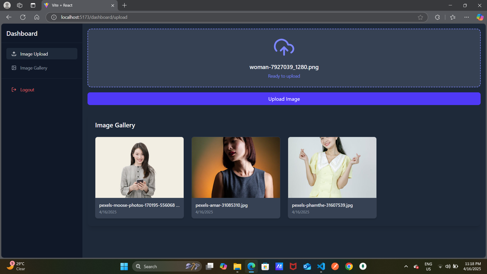
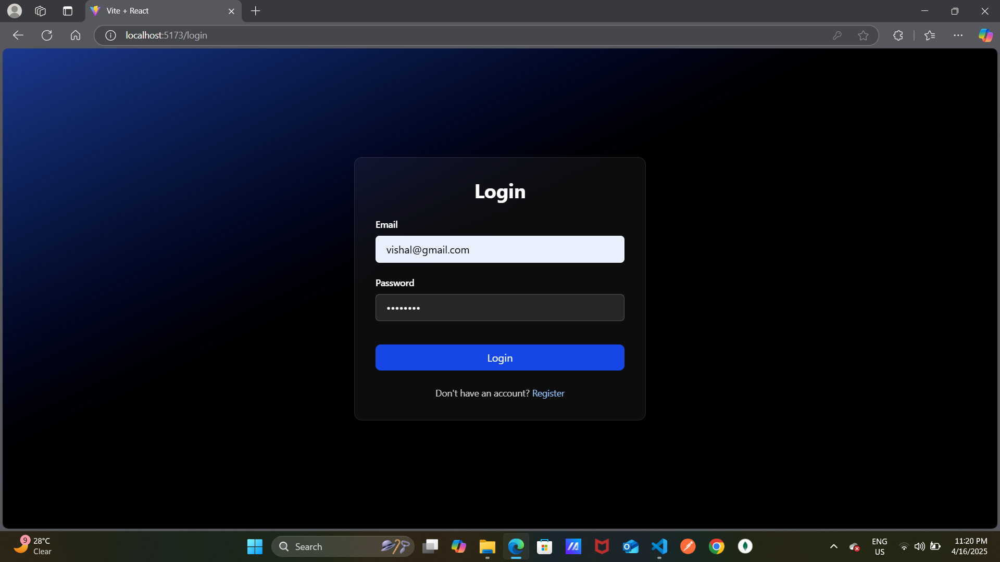
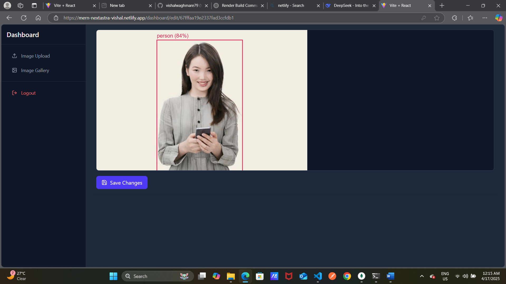
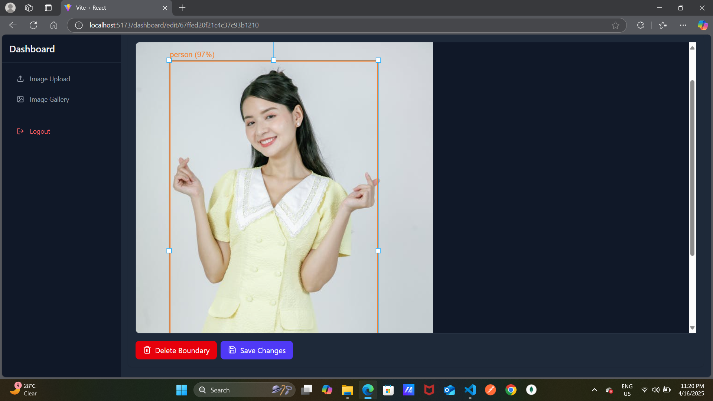

# AI-Powered Image Annotation Dashboard



A sophisticated image annotation platform combining TensorFlow.js for AI-powered boundary detection and Konva.js for interactive editing. Built with the MERN stack for full-stack efficiency.

🔗 **Live Demo**: [https://mern-nextastra-vishal.netlify.app/](https://mern-nextastra-vishal.netlify.app/)

## Key Features

### 🛡️ Secure Authentication
- JWT token-based authentication
- Bcrypt password hashing
- Form validations for login/registration

### 🖼️ AI-Powered Image Processing
- **TensorFlow.js integration** for automatic boundary detection
- Custom-trained models for object recognition
- Confidence scoring for detected boundaries

### ✏️ Interactive Annotation Tools
- **Konva.js canvas** for boundary manipulation
- Create, resize, and move bounding boxes
- Label editing with confidence indicators
- Multi-object selection and editing

### 📊 Data Management
- MongoDB Atlas for cloud storage
- Image metadata preservation
- Versioned boundary data storage

## Technology Stack

### Frontend
| Technology | Usage |
|------------|-------|
| React | Core framework |
| Konva.js | Interactive canvas editing |
| TensorFlow.js | AI boundary detection |
| Tailwind CSS | Responsive styling |
| React Icons | UI icons |

### Backend
| Technology | Usage |
|------------|-------|
| Node.js | Runtime environment |
| Express | REST API framework |
| MongoDB | Database storage |
| Mongoose | ODM for MongoDB |
| JWT | Secure authentication |

### AI/ML
| Technology | Usage |
|------------|-------|
| TensorFlow.js | Client-side object detection |
| COCO-SSD | Pre-trained model |
| Custom Layers | Domain-specific adaptations |

## Screenshots

| Feature | Preview |
|---------|---------|
| **Login Page** |  |
| **Image Upload** |  |
| **Auto-Detection** |  |
| **Manual Editing** |  |

## Installation Guide

### Prerequisites
- Node.js v16+
- MongoDB Atlas account or local MongoDB
- TensorFlow.js compatible browser

### Backend Setup
```bash
cd server
npm install
cp .env.example .env
# Configure your .env file
npm start
```

### Frontend Setup
```bash
cd client
npm install
npm run dev
```

## Configuration

### Key Environment Variables
```env
# Server
PORT=5000
MONGO_URI=mongodb+srv://your-connection-string
JWT_SECRET=your_secure_secret

# Client
VITE_API_URL=http://localhost:5000/api
```

## Development Workflow

1. **Automatic Boundary Detection**:
   ```javascript
   // Using TensorFlow.js COCO-SSD model
   const model = await cocoSsd.load()
   const predictions = await model.detect(imageElement)
   ```

## Performance Benchmarks

| Operation | Average Time |
|-----------|-------------|
| Image Upload | 1.2s |
| TF.js Detection (1080p) | 3.8s |
| Boundary Edit Sync | 0.4s |
